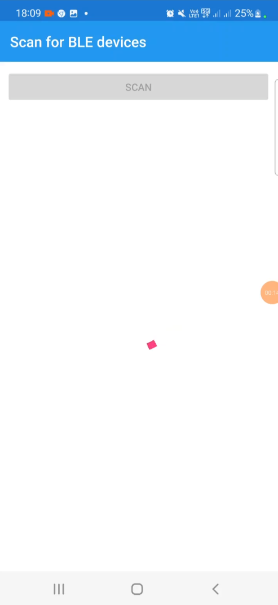
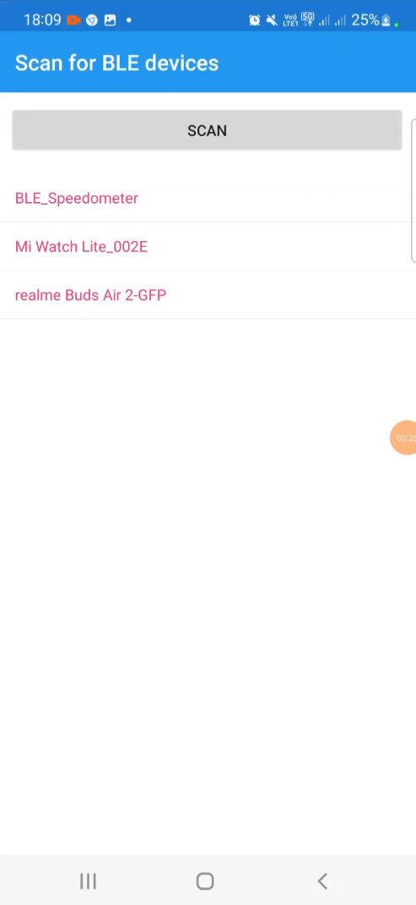
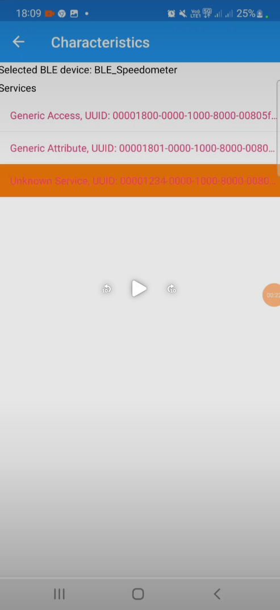
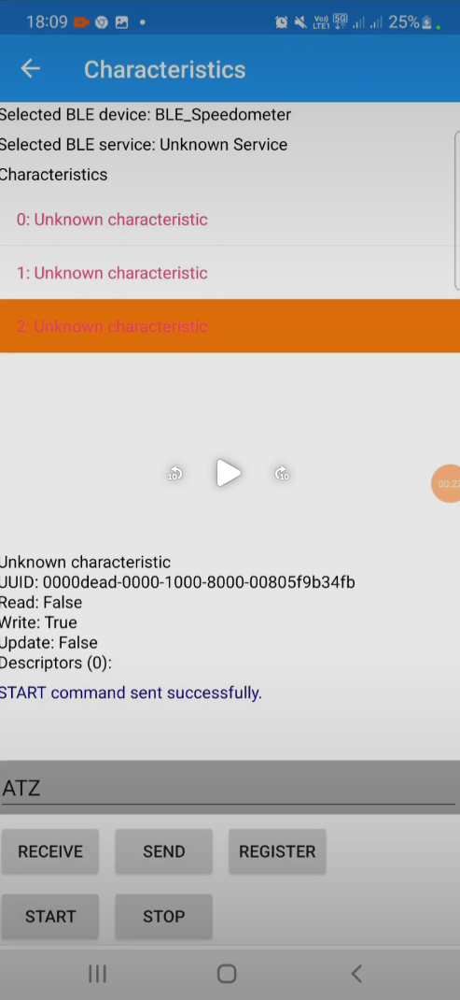
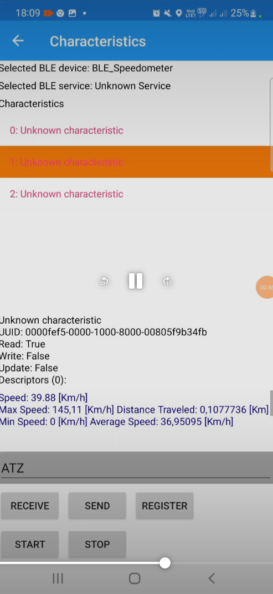
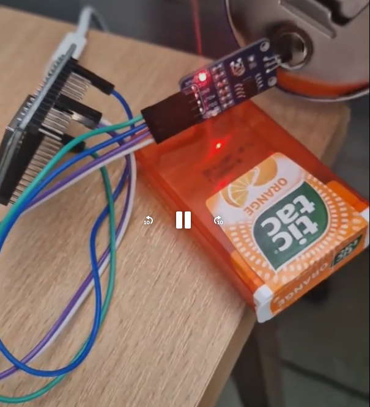

# Bicycle Speedometer (ESP32 + BLE)

An embedded system project that measures bicycle speed using a Hall sensor and transmits real-time data to a mobile application via Bluetooth Low Energy (BLE).

---

## Project Overview

This project implements a **wireless bicycle speedometer** based on an ESP32 microcontroller and a Hall effect sensor.

A magnet attached to the wheel passes near the sensor during rotation, generating signals that are used to calculate:

- rotational speed (RPM)
- linear speed (km/h)
- distance traveled

The measured data is transmitted via **Bluetooth (BLE)** to an Android application, where it is displayed in real time.

---

## System Architecture

The system consists of:

- ESP32 microcontroller
- Hall sensor (AH49E)
- Magnet mounted on the bicycle wheel
- Android smartphone (BLE client)

Based on system diagram and implementation 

---

## How It Works

1. A magnet is attached to the bicycle wheel.
2. Each wheel rotation triggers the Hall sensor.
3. ESP32 reads analog signal via ADC (GPIO32).
4. Time between pulses is measured.
5. Speed is calculated:

   - RPM → linear speed (km/h)
6. Data is sent via BLE to the mobile app.
7. The app displays real-time parameters.

---

## Mobile App Features

The Android application (built with Xamarin) displays:

- current speed
- maximum speed
- minimum speed
- average speed
- distance traveled

As shown in the app interface (see project documentation) 

---

## Hardware Components

- ESP32 microcontroller
- Hall sensor (AH49E, Waveshare module)
- Magnet (mounted on wheel)
- Power module (18650 battery)
- Android smartphone

---

## Software

### ESP32 (ESP-IDF + FreeRTOS)

- ADC reading from Hall sensor
- threshold detection (~1900 mV)
- RPM calculation
- conversion to linear speed
- BLE communication (NimBLE)
- multitasking with FreeRTOS

### Mobile App (Xamarin / C#)

- BLE connection handling
- real-time data visualization
- statistics calculation (min, max, average speed)

---

## Key Features

- real-time speed measurement
- wireless communication (BLE)
- cross-platform embedded + mobile system
- configurable for different wheel sizes
- low-power embedded solution

---

## Testing

The system was tested by moving a magnet near the sensor at different speeds.
The measured data was verified both in:

- terminal output
- mobile application

The device correctly calculated speed and responded to varying rotation frequencies 

---
## Demo

### BLE Device Scan

The application scans nearby Bluetooth Low Energy devices and detects the ESP32 module as **BLE_Speedometer**.

---

### BLE Connection

After selecting the device, the application establishes a BLE connection.

---

### BLE Services

Available BLE services are discovered, including standard and custom services used for communication.

---

### BLE Characteristics

The application accesses BLE characteristics, which are used to send and receive data from the ESP32.

---

### Real-Time Data

The system displays real-time measurements received from ESP32:

- speed (km/h)
- max speed
- min speed
- average speed
- distance traveled

---

### Hardware Setup

ESP32 connected with a Hall sensor and powered by a battery module.
A magnet triggers the sensor to detect wheel rotation.

---

## Possible Improvements

- GPS integration
- better UI/UX for mobile app
- data logging (history)
- cloud synchronization
- waterproof casing for real-world usage

---

## Author

Hubert Jabłoński  
Michał Miś
